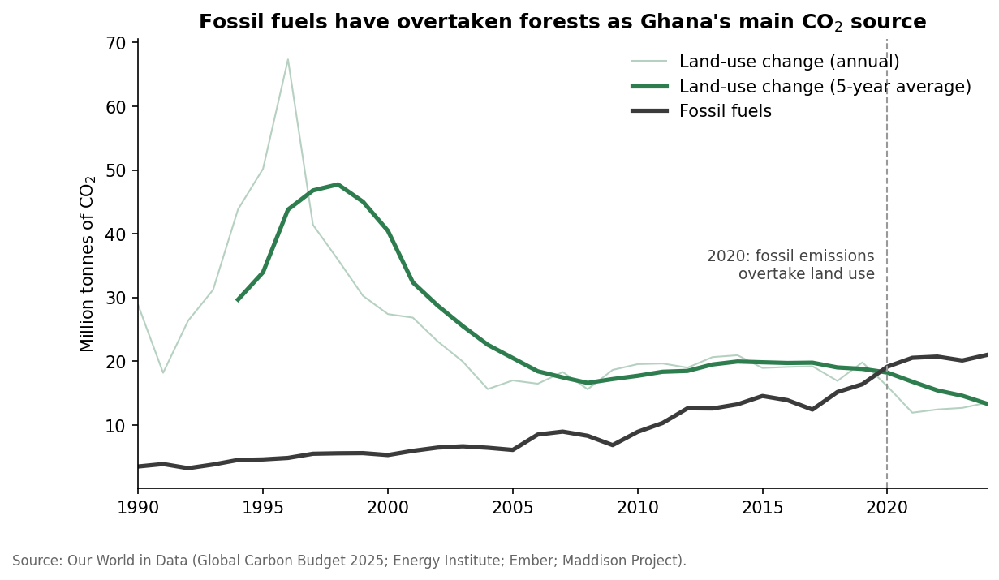
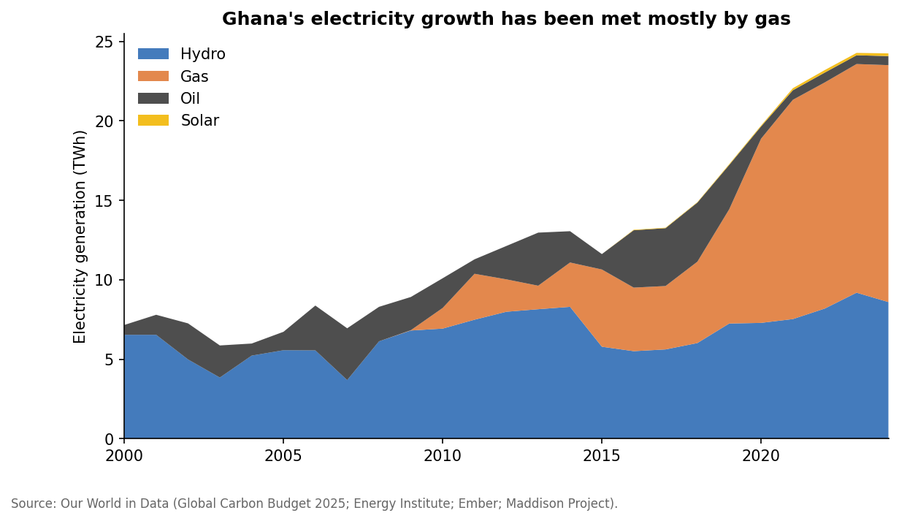

# From Forests to Fossil Fuels: How Ghana's CO₂ Emissions Have Changed (1990–2024)

An analysis of Ghana's carbon dioxide emissions using public data from [Our World in Data](https://ourworldindata.org/). It looks at which fuels are driving emissions growth, how the balance between forest loss and fossil fuels has shifted, how Ghana compares with its West African neighbours, and whether economic growth is decoupling from emissions.

**Tools:** Python · pandas · NumPy · Matplotlib · Jupyter

## Key findings

- **Fossil CO₂ emissions grew about six-fold**, from 3.5 Mt in 1990 to 21.0 Mt in 2024 (about 5.4% a year). Oil makes up 60% of the 2024 total and gas 37%.
- **The rise in gas emissions tracks the power sector.** Hydropower's share of electricity fell from 91% in 2000 to 35% in 2024, while gas-fired generation rose from zero to 61%. Solar is still under 1%.
- **Fossil fuels have overtaken forests.** Land-use change made up 89% of Ghana's CO₂ emissions in 1990 and 39% in 2024, and 2020 was the first year fossil emissions were higher.
- **Emissions are still low by global standards**: 0.61 t of fossil CO₂ per person, about 13% of the world average.
- **No decoupling yet.** Between 2000 and 2022, GDP grew 3.5× and fossil CO₂ grew 3.9×, and the carbon intensity of GDP is flat over two decades.





## Questions answered

1. How fast have Ghana's fossil CO₂ emissions grown, and which fuels are driving the growth?
2. What explains the rapid rise in emissions from gas?
3. How has the balance between land-use change (forests) and fossil fuels shifted?
4. How does Ghana compare with its West African neighbours and the world?
5. Is Ghana's economy growing faster than its emissions?

## Approach

1. **Data loading:** downloads the Our World in Data CO₂ and energy datasets on first run and caches them locally.
2. **Data quality checks:** reviews the years each variable covers, confirms the fuel breakdown adds up to reported totals, and measures how noisy the land-use series is.
3. **Analysis:** calculates growth rates, fuel and electricity shares, land-use vs fossil balance (with a 5-year rolling average), per-person comparisons, and indexed GDP vs emissions growth.
4. **Communication:** each section ends with a plain-language interpretation, followed by overall conclusions, limitations and next steps.

## Data sources

| Dataset | Source | Used for |
|---|---|---|
| [CO₂ and greenhouse gas emissions](https://github.com/owid/co2-data) | Our World in Data, based on the Global Carbon Budget 2025 and Maddison Project Database 2023 | Emissions by fuel, land-use change, per-person emissions, GDP |
| [Energy](https://github.com/owid/energy-data) | Our World in Data, based on the Energy Institute and Ember | Electricity generation by source |

Our World in Data publishes this data under a CC BY licence.

## How to run

```bash
git clone https://github.com/Fiona-neena/ghana-co2-analysis.git
cd ghana-co2-analysis
pip install -r requirements.txt
jupyter notebook ghana_co2_analysis.ipynb
```

The notebook downloads the data into `data/` the first time it runs.

## Repository structure

```
ghana-co2-analysis/
├── ghana_co2_analysis.ipynb   # Full analysis with code, charts and interpretation
├── figures/                   # Charts exported by the notebook
├── data/                      # Raw data (downloaded automatically, not tracked)
├── requirements.txt
└── README.md
```

## Limitations

- National land-use emissions are modelled estimates with wide uncertainty; the long-term trend is more reliable than individual years.
- GDP data ends in 2022, so the decoupling analysis stops there.
- Our World in Data updates these files regularly, so rerunning the notebook may change figures slightly. Results here use the Global Carbon Budget 2025 release.

## Author

**Fiona Neena Achiamaa Frimpong** · Data Analyst, environmental and climate research
[LinkedIn](https://linkedin.com/in/fiona-frimpong) · [GitHub](https://github.com/Fiona-neena)
